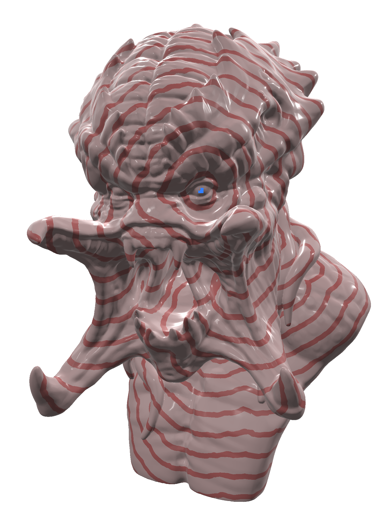
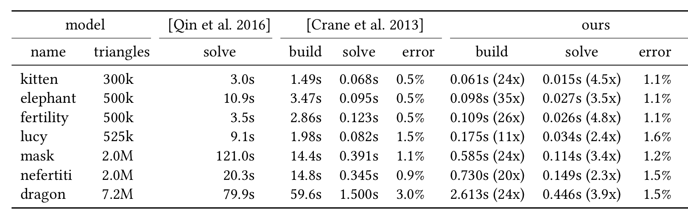
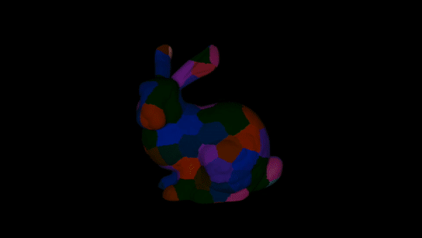

# Geodesic Graph
An approximate geodesic distance solver for massive datasets.



# Results

Comparison between this geodesic solver, and the solver from [Crane et al. 2013](https://arxiv.org/abs/1204.6216), the fastest solver for approximate geodesics. For the latter, the implementation provided by the author was used, using Cholmod as backend. Columns `build` report pre-processing times to pre-factor the system and to build the graph, respectively. Build times for this solver also include the time to compute the triangle adjacency needed to build the graph. Columns `solve` report average time for computing the distance field from a single point source, where average is taken over 100 random samples. Root-mean-square errors are computed with respect to the exact polyhedral solution from [Qin et al. 2016](https://dl.acm.org/doi/10.1145/2897824.2925930).

# Parallelization

The solver also supports lock-free parallel execution. In the parallel case, the algorithm does not change, only the data structure does. The mesh is partitioned into sub-mesh, over which the algortithm can run in parallel. After each round, the boundary information is updated in a synchronization step.


# Build
With Ninja installed
```bash
python3 scripts/build.py release
```
Otherwise
```bash
mkdir build
cd build
cmake ..
make
```